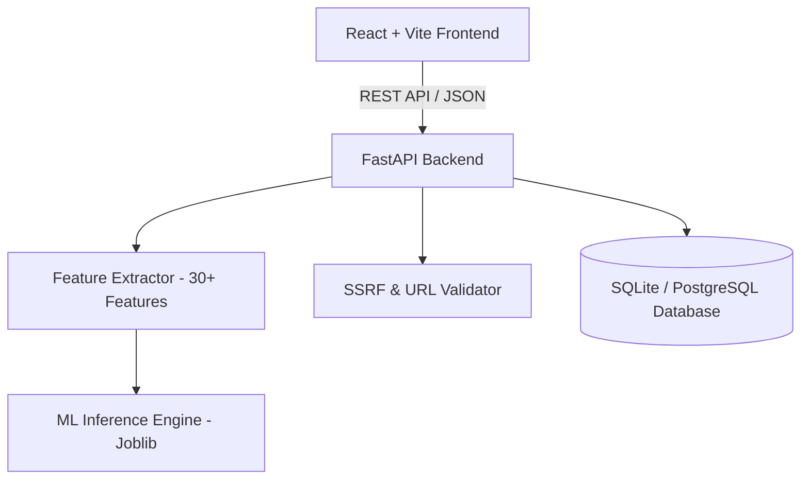

# 🛡️ PhishShield — AI-Based Phishing Website Detection System

An enterprise-grade, high-performance security platform that leverages Machine Learning (HistGradientBoosting Classifier), heuristic feature extraction, and real-time domain threat intelligence to detect and analyze phishing URLs with sub-second latency.

---

## 🌟 Key Features

- **⚡ Sub-Second AI Prediction**: Extracts 30+ lexical, domain, and structural URL features to predict threat probabilities.
- **🛡️ SSRF-Safe Scanning**: Safe DNS resolution and IP validation prevents internal network probing or SSRF exploits.
- **📊 Real-Time Analytics Dashboard**: Visual risk gauges, threat badges, confidence metrics, and scan history.
- **👥 Role-Based Authentication**: Secure JWT-based authentication with role management (User / Admin).
- **📦 Batch Scanning**: Analyze multiple URLs concurrently with aggregated risk summaries.
- **📚 Interactive API Documentation**: Swagger UI (`/docs`) and ReDoc (`/redoc`) powered by FastAPI.

---

## 🏗️ System Architecture



---

## 🚀 Quick Start (Local Setup)

### Prerequisites
- Python 3.10+
- Node.js 18+ and npm

### 1. Backend Setup

```bash
# Navigate to project root
cd "Phishing Website Detection System"

# Create and activate Python virtual environment
python -m venv venv
# Windows:
.\venv\Scripts\activate
# Linux/macOS:
source venv/bin/activate

# Install dependencies
pip install -r backend/requirements.txt

# Start backend server
uvicorn backend.app.main:app --reload --host 127.0.0.1 --port 8000
```
- API Docs: [http://127.0.0.1:8000/docs](http://127.0.0.1:8000/docs)

### 2. Frontend Setup

```bash
# In a separate terminal
cd frontend

# Install packages
npm install

# Start Vite dev server
npm run dev
```
- Web Application: [http://localhost:5173](http://localhost:5173)

---

## 🧪 Testing

Run backend unit and integration test suite:
```bash
pytest
```

---

## 🌐 Deployment & Hosting Guide

### Backend Hosting (Render / Railway / Fly.io)
1. **Build Command**: `pip install -r backend/requirements.txt`
2. **Start Command**: `uvicorn backend.app.main:app --host 0.0.0.0 --port $PORT`
3. **Environment Variables**:
   - `JWT_SECRET`: A secure 32+ character random string
   - `CORS_ORIGINS`: Your production frontend domain URL (e.g. `https://your-app.vercel.app`)

### Frontend Hosting (Vercel / Netlify)
1. **Root Directory**: `frontend`
2. **Build Command**: `npm run build`
3. **Output Directory**: `dist`
4. **Environment Variables**:
   - `VITE_API_URL`: Your hosted backend URL (e.g. `https://phishshield-api.onrender.com`)

---

## 📁 Repository Structure

```
.
├── backend/                  # FastAPI Application
│   ├── app/
│   │   ├── api/v1/           # API Endpoints (Auth, Scans, Dashboard, Admin)
│   │   ├── core/             # Config, Security, DB Engine
│   │   ├── models/           # SQLAlchemy ORM Models
│   │   ├── schemas/          # Pydantic Schemas
│   │   ├── services/         # Business Logic
│   │   └── ml/               # Model Predictor & Features
│   └── requirements.txt      # Backend Dependencies
├── frontend/                 # React + Vite Frontend
│   ├── src/
│   │   ├── components/       # UI Components (Gauges, Badges, Charts)
│   │   ├── context/          # Auth Context & State
│   │   ├── pages/            # Scanner, Dashboard, History, Auth Pages
│   │   └── services/         # API Client
│   └── package.json
├── ml/                       # Machine Learning Pipeline & Training
│   ├── dataset/              # Training Datasets
│   ├── feature_extractor.py  # Standalone Extractor
│   └── train.py              # ML Training & Evaluation Script
├── docs/                     # Architecture & Database Docs
├── tests/                    # Pytest Suite
├── .gitignore
└── README.md
```

---

## 📄 License
This project is licensed under the MIT License.
